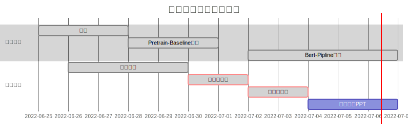

# AI-LI:智能判决书分类与打标平台

### 项目介绍

利用自然语言预训练模型对法律文本进行多标签多分类任务，并搭建判决书分类与打标平台以方便法律实习生使用。

关键词：自然语言处理，分类任务，多标签，多分类，法律任务。

项目来源：CAIL2021年多案件标签分类比赛，增加了部分数据集&增加标签语义。

原始比赛链接：http://cail.cipsc.org.cn/task8.html

个人基础方案：单句预测标签最终结果求并集作为案件的标签。

个人改进方案：滑动窗多标签并集模型及负样本采样的训练策略。


### 项目周期



### 项目网站
网址：http://law.seutools.com/

网站源码：```./reger-web/```

网站的三个功能：

1. **从本地拖入文件给判决文书分类**
2. **增改查找判决书所属分类**
3. **导出所属分类到本地的文件**


## 运行

### 构建数据集

```python
python data_process.py --train_rate=0.8 --content_size=500
```

### 训练模型

```
cd bert-bseline
```

base实验运行：
```
python train_wandb.py --debug --debug_train_num=200 --debug_valid_num=40 --train_batch=16 --valid_batch=64 --model_path=bert-base-chinese --learning_rate=5e-5 --train_rate=0.8 --content_size=100 --epoch_number=10 --freeze --pn_rate=1 --time_limit=20
```

pn_rate 10：
```
python train_wandb.py --debug --debug_train_num=200 --debug_valid_num=40 --train_batch=16 --valid_batch=64 --model_path=bert-base-chinese --learning_rate=5e-5 --train_rate=0.8 --content_size=100 --epoch_number=10 --freeze --pn_rate=10 --time_limit=20
```

pn_rate 0.1
```
python train_wandb.py --debug --debug_train_num=200 --debug_valid_num=40 --train_batch=16 --valid_batch=64 --model_path=bert-base-chinese --learning_rate=5e-5 --train_rate=0.8 --content_size=100 --epoch_number=10 --freeze --pn_rate=0.1 --time_limit=20
```

freeze = false
```
python train_wandb.py --debug --debug_train_num=200 --debug_valid_num=40 --train_batch=16 --valid_batch=64 --model_path=bert-base-chinese --learning_rate=5e-5 --train_rate=0.8 --content_size=100 --epoch_number=10 --pn_rate=1 --time_limit=20
```

content_size = 500
```
python train_wandb.py --debug --debug_train_num=200 --debug_valid_num=40 --train_batch=16 --valid_batch=64 --model_path=bert-base-chinese --learning_rate=5e-5 --train_rate=0.8 --content_size=500 --epoch_number=10 --freeze --pn_rate=1 --time_limit=20
```

train
```
python train_wandb.py --train_batch 32 --valid_batch 64 --model_path bert-base-chinese --learning_rate 5e-5 --train_rate 0.8 --content_size 500 --epoch_number 20 --freeze --pn_rate 1 --time_limit 100
```


train 100with unbalance
```
python train_wandb.py --train_batch 16 --valid_batch 64 --model_path bert-base-chinese --learning_rate 5e-5 --train_rate 0.8 --content_size 100 --epoch_number 20 --freeze --pn_rate 1 --time_limit 100
```

train 100with unbalance
```
python train_wandb.py --train_batch 16 --valid_batch 64 --model_path hfl/chinese-bert-wwm --learning_rate 5e-5 --train_rate 0.8 --content_size 100 --epoch_number 20 --freeze --pn_rate 1 --time_limit 100
```

常见的模型：[bert-base-chinese,hfl/chinese-bert-wwm,hfl/chinese-bert-wwm-ext,hfl/chinese-roberta-wwm-ext,thunlp/Lawformer]

python train_wandb.py --train_batch 16 --valid_batch 64 --model_path hfl/chinese-bert-wwm --learning_rate 5e-5 --train_rate 0.8 --content_size 100 --epoch_number 20 --freeze --pn_rate 1 --time_limit 100

debug测试：
python train_wandb.py --debug --train_batch 16 --valid_batch 64 --model_path hfl/chinese-bert-wwm-ext --learning_rate 5e-5 --train_rate 0.8 --content_size 100 --epoch_number 20 --freeze --pn_rate 1 --time_limit 100

参数优化
python train_wandb.py --train_batch 16 --valid_batch 64 --model_path hfl/chinese-roberta-wwm-ext --learning_rate 2e-5 --train_rate 0.8 --content_size 100 --epoch_number 20 --freeze --pn_rate 1 --time_limit 100

全量模型：
python train_wandb.py --train_batch 16 --valid_batch 64 --model_path hfl/chinese-roberta-wwm-ext --learning_rate 5e-5 --train_rate 0.999 --content_size 100 --epoch_number 20 --freeze --pn_rate 1 --time_limit 500

可能预备模型：
9b1519a4f2 : 0.5474
```
python train_wandb.py --train_batch 16 --valid_batch 64 --model_path hfl/chinese-roberta-wwm-ext --learning_rate 5e-5 --train_rate 0.8 --content_size 100 --epoch_number 20 --freeze --pn_rate 1 --time_limit 500
```

1573bde29b : 0.5483
```
python train_wandb.py --train_batch 16 --valid_batch 64 --model_path hfl/chinese-roberta-wwm-ext --learning_rate 2e-5 --train_rate 0.8 --content_size 200 --epoch_number 20 --freeze --pn_rate 1 --time_limit 500
```


