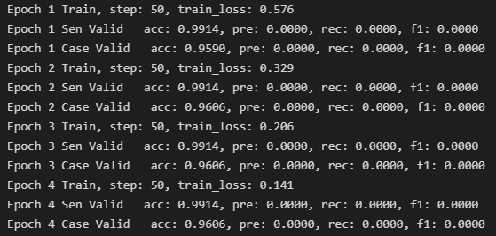

### 项目介绍

关键词：自然语言处理，分类任务，多标签，多分类，法律任务。

项目来源：CAIL2021年多案件标签分类比赛，增加了部分数据集&增加标签语义。

原始比赛链接：http://cail.cipsc.org.cn/task8.html

冠军方案：https://m.sohu.com/a/502009176_121123754/

冠军方案核心：滑动窗多标签并集模型及负样本采样的训练策略。

个人基础方案：单句预测标签最终结果求并集作为案件的标签。

### 运行

1. 进入目录:

```
cd ./bert-baseline
```

2. 创建训练数据：

```
python dataprocess.py 
```

3. 训练：

   运行```train_base.ipynb```。

### 参数

1. 模型路径如果有中文预训练模型就直接使用，如果没有则从hugging face上下载。

   ```python
   model_path = model_root_path + '/'+model_list[model_idx]+'/'
   # model download from hugging-face
   model_path = 'bert-base-chinese'
   ```

2. 负样本比例选择

   我不清楚具体选择多少，设置0.5感觉无法训练出来。

### 问题

训练loss下降指标正常，测试集的f1完全没有没有收敛。



可能原因：

1. 负样本采样选择比例错误
2. 模型数据较少。

